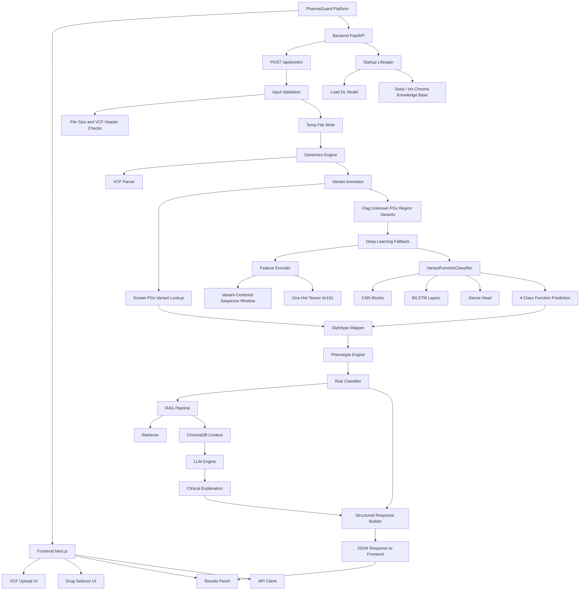

# PharmaGuard System Tree (Mermaid)

```mermaid
graph TD
    A[PharmaGuard Platform]

    A --> B[Frontend Next.js]
    B --> B1[VCF Upload UI]
    B --> B2[Drug Selector UI]
    B --> B3[Results Panel]
    B --> B4[API Client]

    A --> C[Backend FastAPI]
    C --> C1[POST /api/predict]
    C --> C2[Startup Lifespan]

    C2 --> C21[Load DL Model]
    C2 --> C22[Seed / Init Chroma Knowledge Base]

    C1 --> D[Input Validation]
    D --> D1[File Size and VCF Header Checks]
    D --> D2[Temp File Write]

    D2 --> E[Genomics Engine]
    E --> E1[VCF Parser]
    E --> E2[Variant Annotator]
    E2 --> E21[Known PGx Variant Lookup]
    E2 --> E22[Flag Unknown PGx Region Variants]

    E22 --> F[Deep Learning Fallback]
    F --> F1[Feature Encoder]
    F1 --> F11[Variant-Centered Sequence Window]
    F1 --> F12[One-Hot Tensor 4x101]

    F --> F2[VariantFunctionClassifier]
    F2 --> F21[CNN Blocks]
    F2 --> F22[BiLSTM Layers]
    F2 --> F23[Dense Head]
    F2 --> F24[4-Class Function Prediction]

    F24 --> G[Diplotype Mapper]
    E21 --> G

    G --> H[Phenotype Engine]
    H --> I[Risk Classifier]

    I --> J[RAG Pipeline]
    J --> J1[Retriever]
    J --> J2[ChromaDB Context]

    J2 --> K[LLM Engine]
    K --> L[Clinical Explanation]

    I --> M[Structured Response Builder]
    L --> M
    M --> N[JSON Response to Frontend]

    N --> B3
```

## Deep Learning Sub-Tree (Focused)

```mermaid
graph LR
    A[Unknown Variant in PGx Region]
    A --> B[Encode Variant Sequence]
    B --> B1[Get 101 bp window]
    B --> B2[One-hot encode to 4x101]

    B2 --> C[CNN Feature Extraction]
    C --> C1[Conv1D + BN + ReLU + MaxPool x3]

    C1 --> D[BiLSTM Context Modeling]
    D --> D1[Bidirectional sequence dependencies]

    D1 --> E[Global Average Pooling]
    E --> F[Dense Classifier]
    F --> G[LogSoftmax over 4 classes]

    G --> H[Predicted Function + Confidence]
    H --> I[Used in diplotype and risk pipeline]
```
